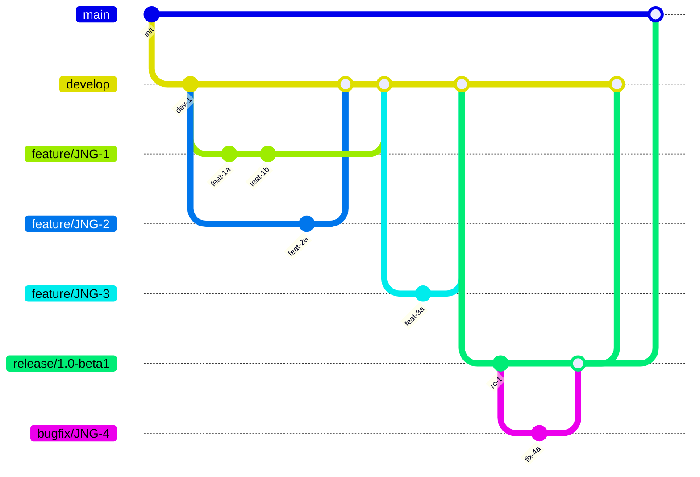
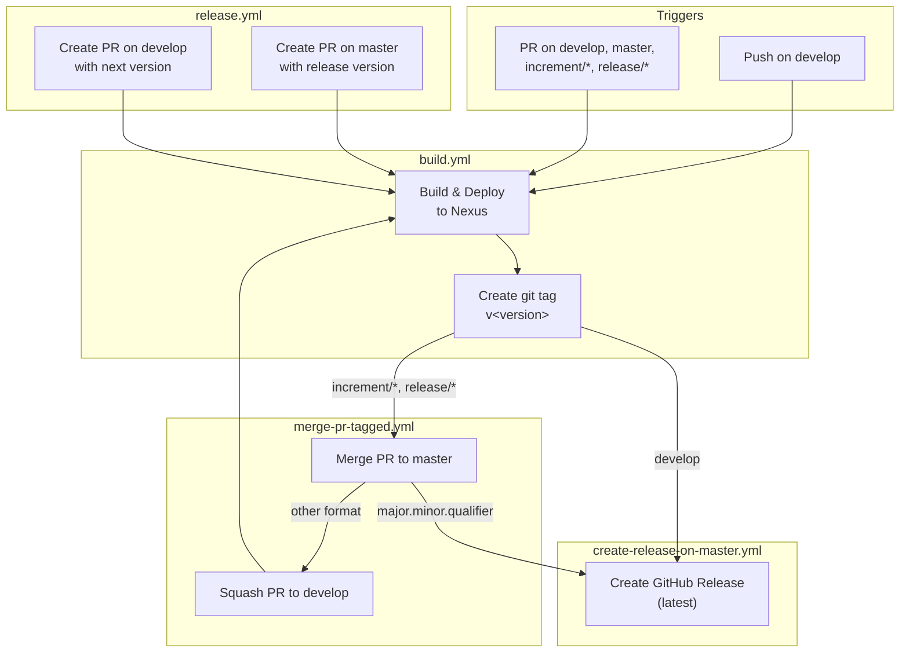
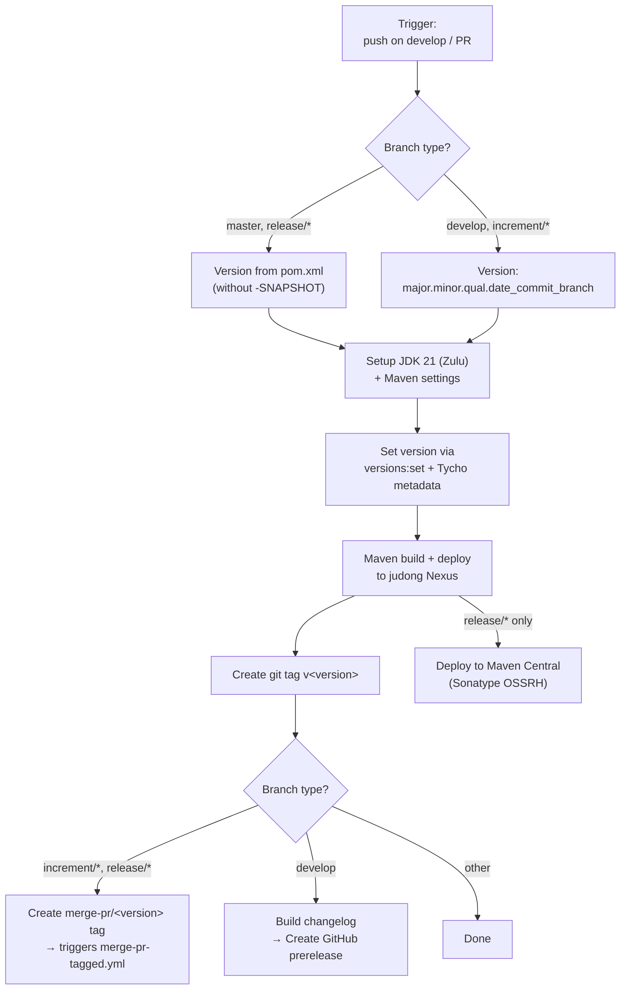
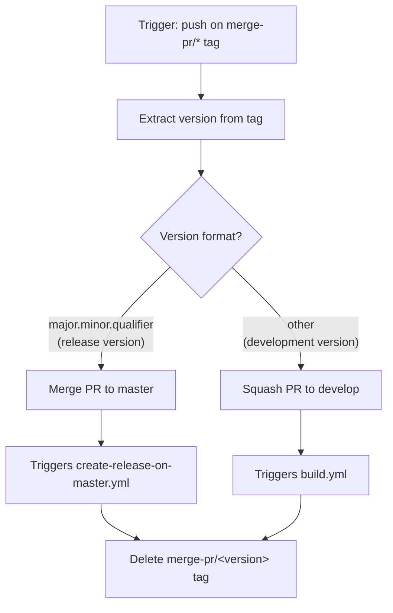
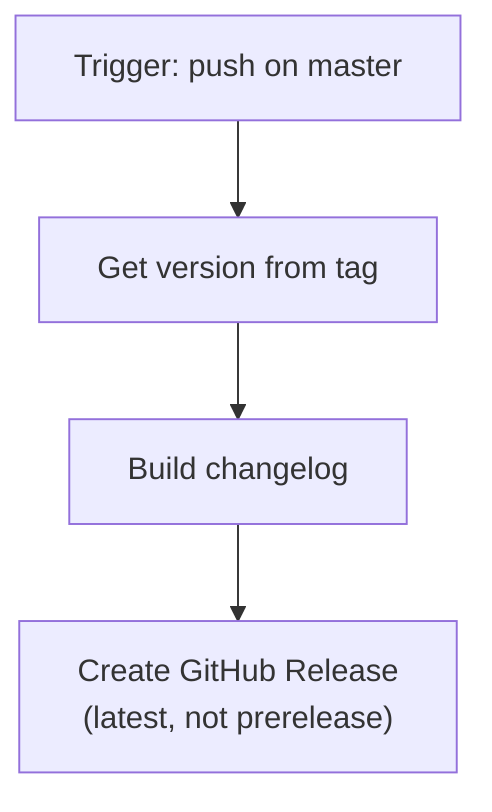
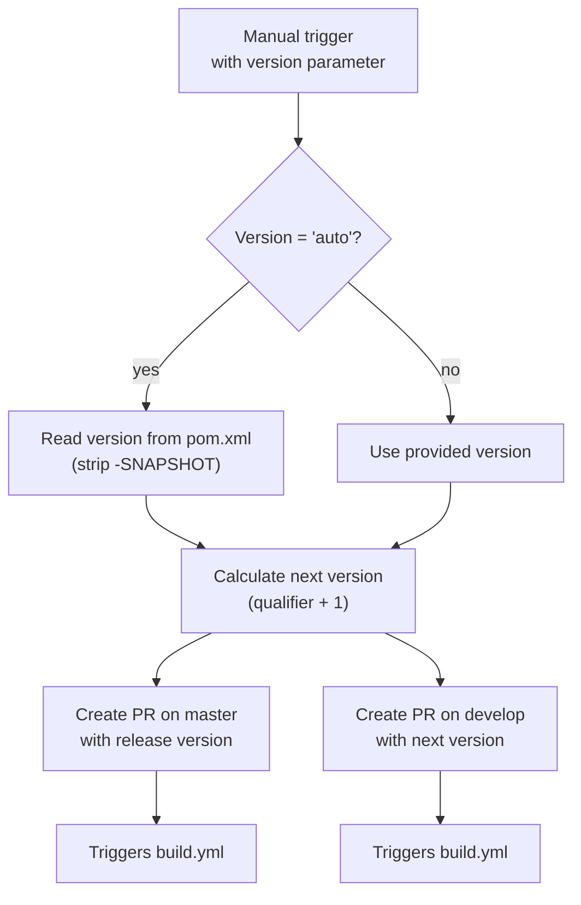
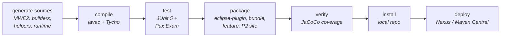
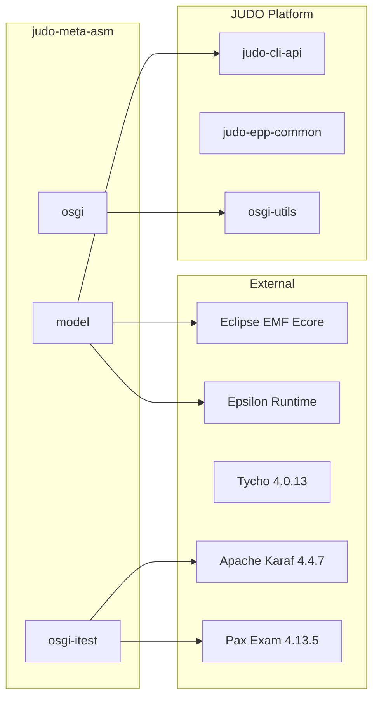

# Development Version and Branch Handling

This document describes the branching strategy, version numbering, and CI/CD pipeline for judo-meta-asm. The workflow is based on GitFlow and uses GitHub Actions for automated builds, deployments, and releases.

## Branching Strategy

The project follows [GitFlow](https://www.atlassian.com/git/tutorials/comparing-workflows/gitflow-workflow) with these branch types:

| Branch Pattern | Base | Purpose |
|---------------|------|---------|
| **develop** | — | Main development branch; contains latest development sources |
| **feature/JNG-xxx_summary** | develop | New features for the next release |
| **(release/)x.y.z** | develop | Stabilization before a release (`release/` prefix reserved for CI) |
| **bugfix/JNG-xxx_summary** | release | Bug fixes applied during release testing; merged back to release and develop |
| **support/JNG-xxx_summary** | release | Minor changes for a previous release; merged back to release |
| **hotfix/JNG-xxx_summary** | master | Critical fixes applied to both master and develop |
| **master** | — | Latest released sources |

### Branch Lifecycle

The following diagram shows how branches are created, merged, and flow through the development lifecycle.



## Version Numbers

Versions follow semantic versioning with rules tied to branch type:

| Branch Type | Version Rule | Example |
|-------------|-------------|---------|
| feature/ | No version change | Inherits develop version |
| develop | 2nd number incremented when release branch starts | `1.2.0-SNAPSHOT` |
| bugfix/ | No version change | Applied on release branch |
| support/ | 3rd number incremented when started | `1.1.1-SNAPSHOT` |
| hotfix/ | 4th number incremented when started | `1.1.0.1-SNAPSHOT` |

CI builds on `develop` and `feature/` branches produce long-form versions like:

```
1.1.4.20260225_103456_abc1234_feature_JNG_6382
```

Release builds on `master` and `release/` branches use the clean version from `pom.xml` without `-SNAPSHOT`.

## GitHub Actions CI/CD Pipeline

The CI/CD system consists of four interconnected workflows. When a build on a release branch completes, it triggers merge and release workflows automatically.

### Pipeline Overview



### build.yml — Build and Deploy

This is the main workflow, triggered on pushes to `develop` and PRs targeting `develop`, `master`, `increment/*`, or `release/*`.



**Key details:**
- Runs on custom `judong` runner
- 30-minute timeout
- GPG-signs artifacts with `sign-artifacts` profile
- Runs SonarQube analysis on `develop` branch
- Sends Discord notification with build status

### merge-pr-tagged.yml — Merge PR

Triggered when a `merge-pr/*` tag is pushed (by `build.yml`). Routes the PR to either `master` or `develop` based on version format.



### create-release-on-master.yml — GitHub Release

Triggered when commits are pushed to `master` (typically from a merged release PR).



### release.yml — Start a Release

Manually triggered with a version parameter (`auto` or a specific `major.minor.qualifier`).



## Build Infrastructure

### Maven Build Phases



### External Dependencies



## How to Develop

For issue tracking we use [JIRA](https://blackbelt.atlassian.net/jira/dashboards).

> **Important:** There is no commit without a ticket number. Every PR and commit message must include `JNG-xxx`.
