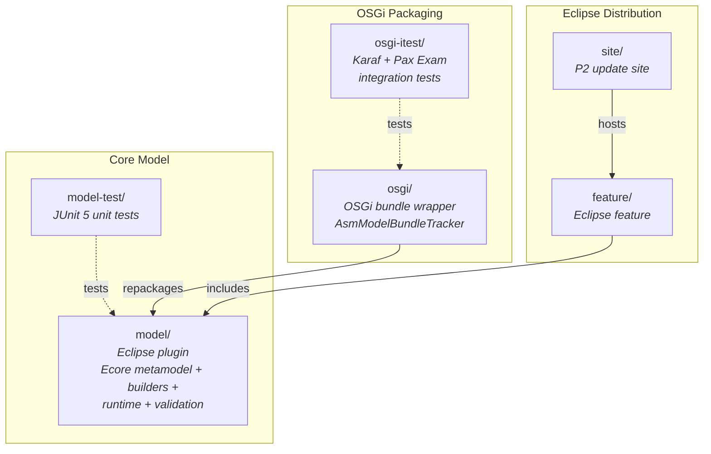
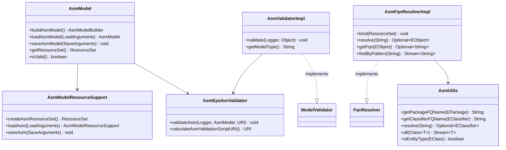
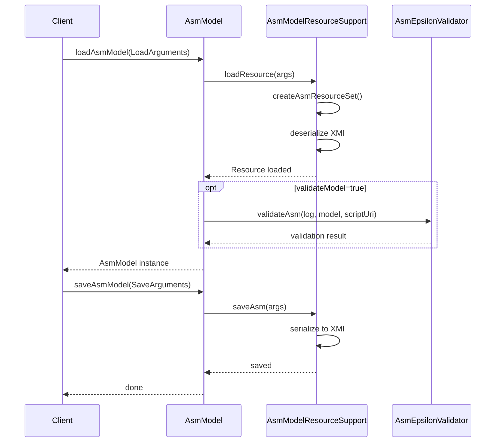

# Contributing to JUDO

This guide covers everything you need to set up a development environment, understand the codebase, and submit changes to judo-meta-asm.

## Development Environment

### Prerequisites

Please make sure your development environment complies with the requirements discussed under the relevant section of the parent project's [CONTRIBUTING](https://github.com/BlackBeltTechnology/judo-community/blob/develop/CONTRIBUTING.adoc) guide.

| Requirement | Version |
|-------------|---------|
| Java JDK | 21 |
| Maven | 3.9.4+ (or use `./mvnw`) |
| Git | Any recent version |

## Code Structure

This project follows a standard Java project structure, governed by Maven, with specialized submodules for Eclipse and OSGi packaging.

### Module Dependency Map

The following diagram shows how modules relate to each other — from the core model through OSGi packaging to Eclipse distribution.



### Eclipse-related submodules

- **`/feature`**: Eclipse feature repository — allows installing this as an Eclipse feature
- **`/site`**: Eclipse P2 Update Site — all built versions are compiled as an update site. The site definition contains the required referenced repositories.

The JUDO update sites are version-based, so each version has its own update site URL. The category definition in Tycho is loaded as an extension because version numbers must be substituted before Tycho activates. A profile handles this:

```sh
mvn clean install -P update-category-versions -f site/pom.xml
```

### Model submodules

- **`/model`**: The core Eclipse plugin. Contains the Ecore metamodel, generated Java classes (builders and helpers via MWE2), hand-written runtime classes (`AsmModel`, `AsmUtils`, `AsmEpsilonValidator`), and Epsilon EVL validation rules.
- **`/model-test`**: JUnit 5 tests covering FQN resolution, builder API, validation engine, EAnnotation handling, and inheritance.

### OSGi submodules

- **`/osgi`**: OSGi bundle that repackages the model and adds services (including `AsmModelBundleTracker`) for consumers in transformation pipelines.
- **`/osgi-itest`**: Integration tests that deploy the bundle in Apache Karaf using Pax Exam.

### Key Public API Classes

The following diagram shows the main runtime classes and their relationships.



### Model Load/Save Flow

This sequence shows what happens when a client loads an ASM model, works with it, and saves it back.



## Working with Eclipse

### Plugin requirements

- m2e (Maven integration)
- Epsilon (validation language support)
- Modeling Tools (Ecore editor)

### Installation

In Eclipse, install the plugin via P2 sites. Go to "Install new software" and add the URL of the update site listed on GitHub (or point to the uncompressed ZIP folder). The plugin contains the metamodel and UI for the default editor.

### Code generation in Eclipse

To run code generation inside Eclipse, execute the MWE2 Workflow:

`hu.blackbelt.judo.meta.asm.model project → src/workflow/generateModel.mwe2`

Required Eclipse features:

- XTend
- XText
- MWE / MWE2

### Code Generation Pipeline

The MWE2 workflow generates code into `model/src-gen/`. **Never hand-edit files in `src-gen/`** — they are regenerated.

```mermaid
flowchart LR
    ECORE["model/Ecore.ecore<br/><i>Ecore metamodel</i>"]
    MWE2["generateModel.mwe2<br/><i>MWE2 workflow</i>"]
    CLEAN["DirectoryCleaner<br/><i>wipe src-gen/</i>"]
    HELPER["HelperGeneratorWorkflow<br/><i>utility methods</i>"]
    BUILDER["BuilderGeneratorWorkflow<br/><i>fluent builder API</i>"]
    RUNTIME["RuntimeModelGeneratorWorkflow<br/><i>JUDO model wrapper</i>"]
    OUTPUT["src-gen/<br/><i>generated Java sources</i>"]

    ECORE --> MWE2
    MWE2 --> CLEAN --> HELPER --> BUILDER --> RUNTIME --> OUTPUT
```



## Troubleshooting

### Running JUnit tests in Eclipse

There is a known issue with Eclipse and Tycho where the classpath does not include JUnit. A `Required-Bundle` has been added to the OSGi Manifest as a workaround (not the Tycho-recommended approach).

See [Eclipse Bug 534587](https://bugs.eclipse.org/bugs/show_bug.cgi?id=534587).

### Problems with Lombok

Tycho does not support Lombok generation directly ([lombok#285](https://github.com/rzwitserloot/lombok/issues/285)). No Lombok is used directly in Eclipse plugin sources — all code is delomboked during the build.

### Problems with Tycho

Tycho 1.4.0 and below does not handle repository references inside site definitions, so all referenced plugin sites must be added manually. See [Eclipse Bug 453708](https://bugs.eclipse.org/bugs/show_bug.cgi?id=453708).

## Version Policy

Maven and Eclipse have different version conventions. Maven uses `-SNAPSHOT` for development versions, while Eclipse uses `.qualifier`. For example, `1.0.0.qualifier` is the Eclipse equivalent of Maven's `1.0.0-SNAPSHOT`.

The Tycho Versions Plugin translates between these two systems in every build. CI builds on `develop` produce versions like `1.1.4.20260225_abc123_branchName`.

## Submission Guidelines

### Submitting an Issue

Before submitting, search the issue tracker — your problem may already be resolved. To help maintainers reproduce the issue, include:

- Output of `java -version` and `mvn -version`
- `pom.xml` or `.flattened-pom.xml` (when applicable)
- A minimal use-case that fails

File new issues via the [issue form](https://github.com/BlackBeltTechnology/judo-meta-asm/issues/new/choose).

### Submitting a PR

This project follows [GitHub's standard forking model](https://guides.github.com/activities/forking/). Fork the project to submit pull requests.

> **Important:** Every commit must reference a JIRA ticket number (`JNG-xxx`).

For details on the CI pipeline, see the [CI Flow](.github/CIFLOW.md) documentation.

## Commands

### Run Tests

```sh
mvn clean test
```

### Run Full Build

```sh
mvn clean install
```
