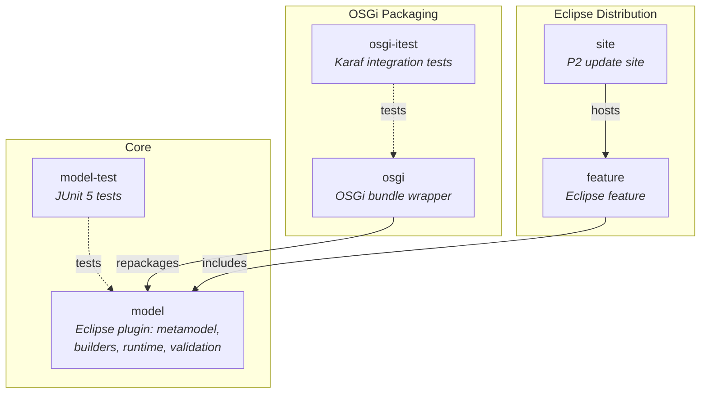
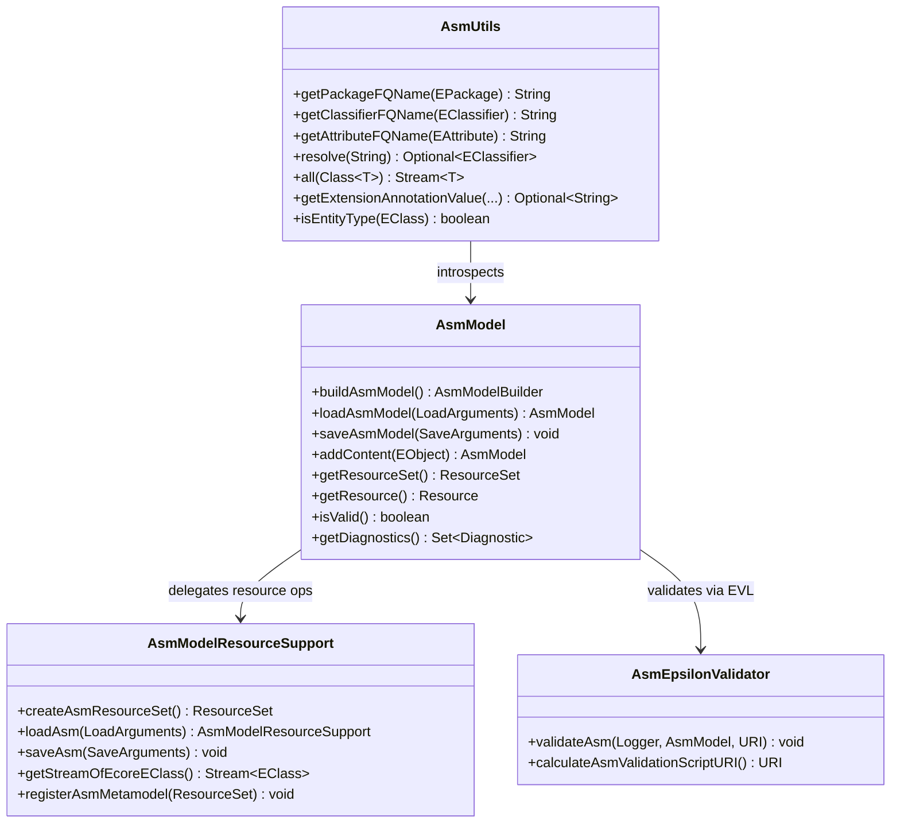
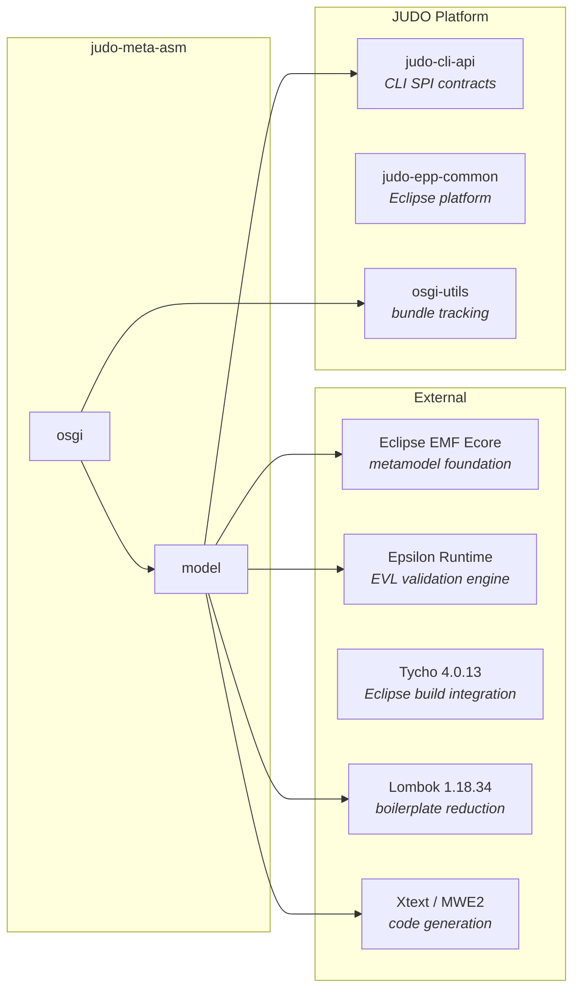
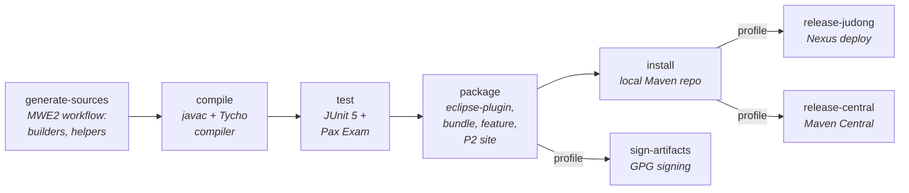

# judo-meta-asm

[](https://github.com/BlackBeltTechnology/judo-meta-asm/actions/workflows/build.yml)

## Introduction

**judo-meta-asm** provides the Abstract Syntax Model (ASM) layer for the [JUDO platform](https://github.com/BlackBeltTechnology/judo-community). It wraps the standard [Eclipse EMF Ecore](https://www.eclipse.org/modeling/emf/) metamodel with:

- **Fluent builder API** — generated classes like `EClassBuilder` and `EAttributeBuilder` for constructing Ecore models programmatically
- **Runtime utilities** — `AsmModel` for model lifecycle (load/save/validate) and `AsmUtils` for FQN resolution, type classification, and annotation access
- **Epsilon-based validation** — EVL (Epsilon Validation Language) rules for model constraint checking
- **CLI integration** — SPI implementations for `ModelValidator` and `FqnResolver` from `judo-cli-api`
- **Multi-platform packaging** — available as an Eclipse plugin (with P2 update site), a standalone OSGi bundle, and a plain Maven dependency

## Module Overview

The project consists of six modules organized into three layers: core model, OSGi packaging, and Eclipse distribution.



| Module | Packaging | Purpose |
|--------|-----------|---------|
| `model/` | `eclipse-plugin` | Core Ecore metamodel, hand-written runtime classes (`AsmModel`, `AsmUtils`, `AsmEpsilonValidator`), generated builders/helpers via MWE2, and EVL validation rules |
| `model-test/` | `jar` | JUnit 5 tests for FQN resolution, builder API, validation engine, annotations, and inheritance |
| `osgi/` | `bundle` | Repackages the model as a standalone OSGi bundle with `AsmModelBundleTracker` for dynamic model registration |
| `osgi-itest/` | `jar` | Integration tests that deploy the OSGi bundle in Apache Karaf via Pax Exam |
| `feature/` | `eclipse-feature` | Eclipse feature definition for plugin installation |
| `site/` | `eclipse-repository` | P2 update site for Eclipse "Install New Software" |

## Key Architecture

The core runtime revolves around four classes that manage model construction, introspection, resource handling, and validation.



## Dependency Graph

The project builds on Eclipse EMF, Epsilon, and several JUDO platform components.



## Build Commands

The build requires **Java 21** and **Maven 3.9.4+**. Use the included Maven wrapper (`./mvnw`).

```bash
# Full build (all modules)
./mvnw clean install

# Run unit tests only
./mvnw clean test -pl model-test

# Run a single test class
./mvnw test -pl model-test -Dtest=AsmUtilsTest

# Run a single test method
./mvnw test -pl model-test -Dtest=AsmUtilsTest#testGetFQN

# Skip Tycho overhead for faster local builds
./mvnw clean install -Dtycho.mode=maven

# Regenerate code from Ecore model
./mvnw generate-sources -pl model
```

## Build Lifecycle

The Maven build uses Tycho for Eclipse plugin packaging and MWE2 for code generation.



## Context

This project is a building block of the [judo-community](https://github.com/BlackBeltTechnology/judo-community) aggregator project. In order to better understand how this module fits into our ecosystem, please check the corresponding documentation!

## Contributing to the project

Everyone is welcome to contribute to JUDO! As a starter, please read the corresponding [CONTRIBUTING](CONTRIBUTING.md) guide for details!

## License

This project is licensed under the [Eclipse Public License - v 2.0](https://www.eclipse.org/legal/epl-2.0/).
